# Big Basket - Flutter Shopping App

A modern, multilingual shopping application built with Flutter that provides a seamless user experience with Arabic and English language support.

## 📱 Project Overview

Big Basket is a feature-rich shopping application that demonstrates advanced Flutter development concepts including:
- Multilingual support (Arabic/English)
- Custom animations and transitions
- Form validation with localization
- Responsive UI design
- State management with SharedPreferences
- Custom font integration

## ✨ Features

### 1. **Aesthetic Welcome Screen**
- Clean, centered design with gradient background
- Two prominent action buttons (Sign In / Sign Up)
- Language toggle functionality
- Custom Suwannaphum font implementation
- Responsive layout

### 2. **User Authentication System**

#### Sign Up Form
- **Full Name validation** with first letter capitalization requirement
- **Email validation** with proper format checking (@domain.com)
- **Password validation** (minimum 6 characters)
- **Confirm Password** matching validation
- Success dialog with smooth navigation transition

#### Sign In Form
- **Email validation** with format checking
- **Password validation** (minimum 6 characters)
- Success dialog with animated navigation
- Persistent login state using SharedPreferences

### 3. **Smooth Animated Transitions**
- **Fade out/in animations** between authentication and main app
- 800ms transition duration for seamless user experience
- Custom PageRouteBuilder implementation

### 4. **Interactive Shopping Home Screen**
- **CustomScrollView** with floating SliverAppBar
- **Featured Products Carousel** with PageView and dot indicators
- **Product Grid** (2 columns) with:
  - Product images with loading states
  - Star ratings display
  - Add to cart functionality with SnackBar feedback
- **Hot Offers Section** with ListView.builder
- **Language toggle** available throughout the app

### 5. **Arabic Language Support**
- Complete RTL (Right-to-Left) text support
- Localized strings using Easy Localization package
- Arabic translations for all UI elements
- Dynamic language switching without app restart

## 🛠️ Setup Instructions

### Prerequisites
- Flutter SDK (>=3.0.0)
- Dart SDK (>=2.17.0)
- Android Studio / VS Code
- Android/iOS device or emulator

### Installation Steps

1. **Clone the Repository**
   ```bash
   git clone https://github.com/yourusername/big_basket.git
   cd big_basket
   ```

2. **Install Dependencies**
   ```bash
   flutter pub get
   ```

3. **Add Custom Font**
   - Place `Suwannaphum-Regular.ttf` in `assets/fonts/` directory
   - Ensure `pubspec.yaml` includes font configuration:
   ```yaml
   fonts:
     - family: Suwannaphum
       fonts:
         - asset: assets/fonts/Suwannaphum-Regular.ttf
   ```

4. **Setup Localization Files**
   - Create `assets/translation/` directory
   - Add `en-US.json` and `ar-EG.json` translation files
   - Include required translation keys (see Translation Keys section)

5. **Run the Application**
   ```bash
   flutter run
   ```

### Required Translation Keys

Create the following translation files:

**assets/translation/en-US.json**
```json
{
  "welcom_mass": "Welcome",
  "sign_in": "Sign In",
  "sign_up": "Sign Up",
  "welcome_back": "Welcome Back",
  "login_big_basket": "Login to Big Basket",
  "email": "Email",
  "enter_your_email": "Enter your email",
  "password": "Password",
  "enter_your_password": "Enter your password",
  "login": "Login",
  "cancel": "Cancel",
  "please_enter_email": "Please enter your email",
  "please_enter_valid_email": "Please enter a valid email",
  "please_enter_password": "Please enter a password",
  "password_min_length": "Password must be at least 6 characters long",
  "first_letter_must_be_uppercase": "name must start with an uppercase letter",
  "create_account": "Create Account",
  "join_big_basket": "Join Big Basket today",
  "full_name": "Full Name",
  "enter_your_full_name": "Enter Your Full Name",
  "confirm_password": "Confirm Password",
  "confirm_your_password": "Confirm Your Password",
  "create": "Create",
  "please_enter_full_name": "Please enter your full name",
  "please_confirm_password": "Please confirm your password",
  "passwords_not_match": "Passwords do not match",
  "account_created_successfully": "Account created successfully",
  "account_signin_successfully": "Account sign-in successfully",
  "success": "Success",
  "close": "close",
  "our_products": "Our Products",
  "featured_products": "Featured Products",
  "hot_offers": "Hot Offers",
  "added_to_cart": "added to the cart",
  "hot": "HOT",
  "premium_headphones": "Premium Headphones",
  "smart_watch": "Smart Watch",
  "wireless_speaker": "Wireless Speaker",
  "gaming_laptop": "Gaming Laptop",
  "wireless_mouse": "Wireless Mouse",
  "coding_keyboard": "Coding Keyboard",
  "usb_c_hub": "USB-C Hub",
  "phone_stand": "Phone Stand",
  "bluetooth_earbuds": "Bluetooth Earbuds",
  "gaming_accessories_offer": "50% Off Gaming Accessories",
  "gaming_accessories_desc": "Limited time offer on all gaming peripherals including keyboards, mice, and headsets.",
  "free_shipping_weekend": "Free Shipping Weekend",
  "free_shipping_desc": "Get free shipping on orders over $50. No minimum purchase required for electronics.",
  "bundle_deal": "Bundle Deal: Phone + Case",
  "bundle_deal_desc": "Buy any smartphone and get a premium case for just $5. Save up to $30 on protection.",
  "student_discount": "Student Discount 20%",
  "student_discount_desc": "Show your student ID and get 20% off on laptops, tablets, and study accessories.",
  "flash_sale": "Flash Sale: Smartwatches",
  "flash_sale_desc": "Lightning deal on premium smartwatches. Only 24 hours left! Up to 40% discount."
}
```

**assets/translation/ar-EG.json**
```json
{
  "welcom_mass": "مرحبا بك",
  "sign_in": "تسجيل الدخول",
  "sign_up": "إنشاء حساب",
  "welcome_back": "مرحبا بعودتك",
  "login_big_basket": "تسجيل الدخول إلى بيج باسكت",
  "email": "البريد الإلكتروني",
  "enter_your_email": "أدخل بريدك الإلكتروني",
  "password": "كلمة المرور",
  "enter_your_password": "أدخل كلمة المرور",
  "login": "دخول",
  "cancel": "إلغاء",
  "please_enter_email": "يرجى إدخال بريدك الإلكتروني",
  "please_enter_valid_email": "يرجى إدخال بريد إلكتروني صحيح",
  "please_enter_password": "يرجى إدخال كلمة المرور",
  "password_min_length": "يجب أن تكون كلمة المرور 6 أحرف على الأقل",
    "first_letter_must_be_uppercase": "يجب أن يبدأ الاسم بحرف كبير",
  "create_account": "إنشاء حساب",
  "join_big_basket": "انضم إلى بيج باسكت اليوم",
  "full_name": "الاسم الكامل",
  "enter_your_full_name": "أدخل اسمك الكامل",
  "confirm_password": "تأكيد كلمة المرور",
  "confirm_your_password": "أكد كلمة المرور",
  "create": "إنشاء",
  "please_enter_full_name": "يرجى إدخال اسمك الكامل",
  "please_confirm_password": "يرجى تأكيد كلمة المرور",
  "passwords_not_match": "كلمات المرور غير متطابقة",
  "account_created_successfully": "تم إنشاء الحساب بنجاح",
  "account_signin_successfully": "تم تسجيل الدخول بنجاح",
  "success": "نجاح",
  "close": "إغلاق",
  "our_products": "منتجاتنا",
  "featured_products": "المنتجات المميزة",
  "hot_offers": "عروضنا المميزه",
  "added_to_cart": "تم إضافته إلى السلة",
  "hot": "مميز",
  "premium_headphones": "سماعات بريميوم",
  "smart_watch": "ساعة ذكية",
  "wireless_speaker": "مكبر صوت لاسلكي",
  "gaming_laptop": "لابتوب ألعاب",
  "wireless_mouse": "ماوس لاسلكي",
  "coding_keyboard": "لوحة مفاتيح برمجة",
  "usb_c_hub": "كابل USB-C",
  "phone_stand": "حامل الهاتف",
  "bluetooth_earbuds": "سماعات بلوتوث",
  "gaming_accessories_offer": "خصم 50% على إكسسوارات الألعاب",
  "gaming_accessories_desc": "عرض محدود على جميع ملحقات الألعاب بما في ذلك لوحات المفاتيح والفئران وسماعات الرأس.",
  "free_shipping_weekend": "شحن مجاني في نهاية الأسبوع",
  "free_shipping_desc": "احصل على شحن مجاني للطلبات التي تزيد عن 50 دولارًا. لا يوجد حد أدنى للشراء للإلكترونيات.",
  "bundle_deal": "عرض حزمة: هاتف + حافظة",
  "bundle_deal_desc": "اشتر أي هاتف ذكي واحصل على حافظة مميزة مقابل 5 دولارات فقط. وفر ما يصل إلى 30 دولارًا على الحماية.",
  "student_discount": "خصم طلابي 20%",
  "student_discount_desc": "أظهر هويتك الطلابية واحصل على خصم 20% على أجهزة الكمبيوتر المحمولة والأجهزة اللوحية وإكسسوارات الدراسة.",
  "flash_sale": "تخفيضات سريعة: الساعات الذكية",
  "flash_sale_desc": "صفقة برق على الساعات الذكية المميزة. باقي 24 ساعة فقط! خصم يصل إلى 40%."
}
```

## 📁 Project Structure

```
lib/
├── data/
│   └── product_data.dart           # Static product data
├── presentation/
│   ├── screens/
│   │   ├── welcome.dart           # Welcome screen
│   │   ├── sign_in_form.dart      # Sign in form
│   │   ├── sign_up_form.dart      # Sign up form
│   │   └── home.dart              # Shopping home screen
│   └── shared/
│       ├── dialogs/
│       │   └── success_dialog.dart # Success dialog widget
│       └── style/
│           └── common_widget_style.dart # Shared styling
├── assets/
│   ├── translation/               # Localization files
│   └── fonts/                     # Custom fonts
└── main.dart                      # App entry point
```

## 🎨 Design Features

- **Gradient Backgrounds**: Teal and pink gradient combinations
- **Material Design**: Following Material 3 design principles
- **Custom Font**: Suwannaphum font for enhanced typography
- **Responsive Layout**: Adapts to different screen sizes
- **Loading States**: Proper loading indicators for network images
- **Error Handling**: Graceful error handling for image loading failures

## 🔧 Key Dependencies

```yaml
dependencies:
  flutter:
    sdk: flutter
  easy_localization: ^3.0.0
  shared_preferences: ^2.0.15
  
dev_dependencies:
  flutter_test:
    sdk: flutter
  flutter_lints: ^2.0.0
```

## 📸 Screenshots

### Welcome Screen
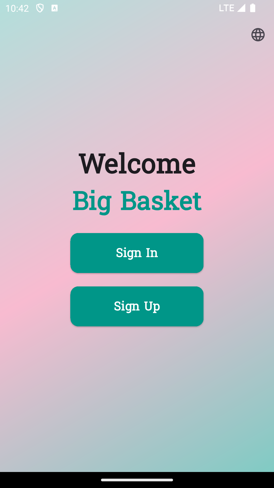
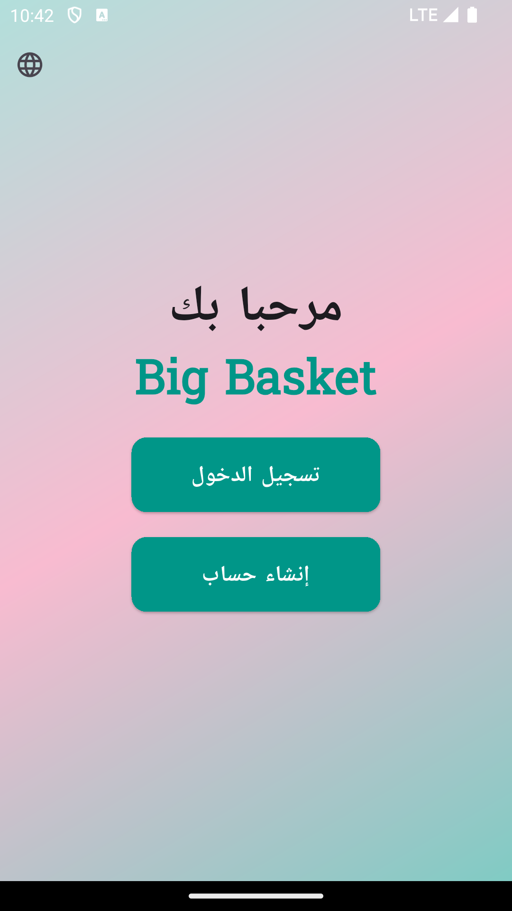

### Authentication Screens
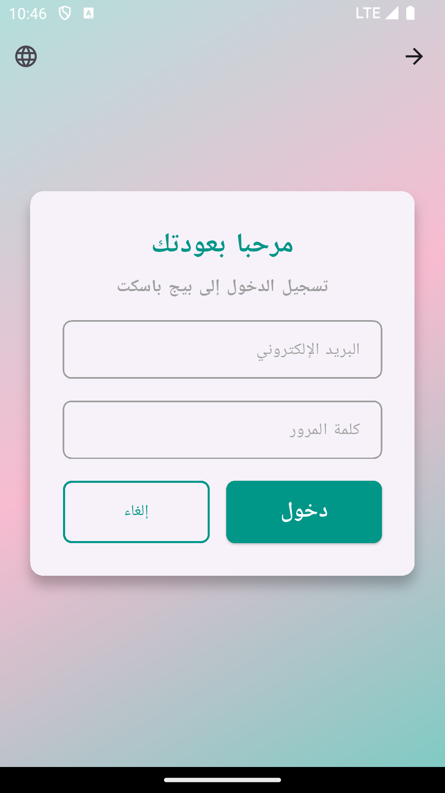
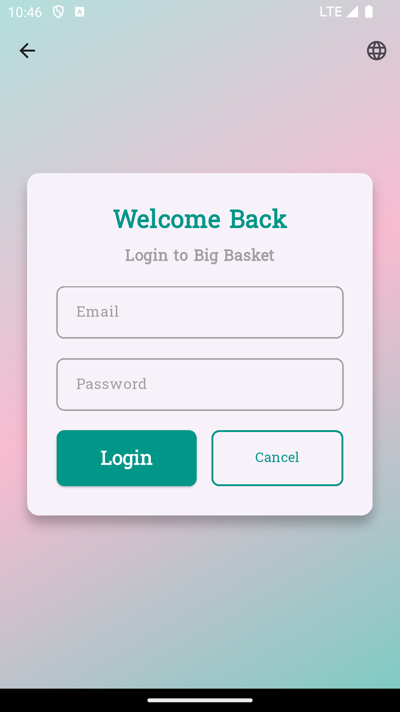

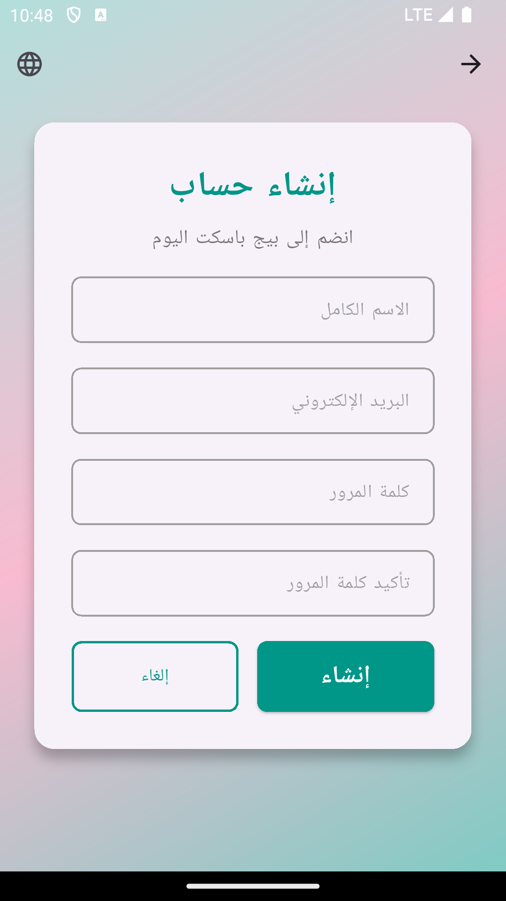
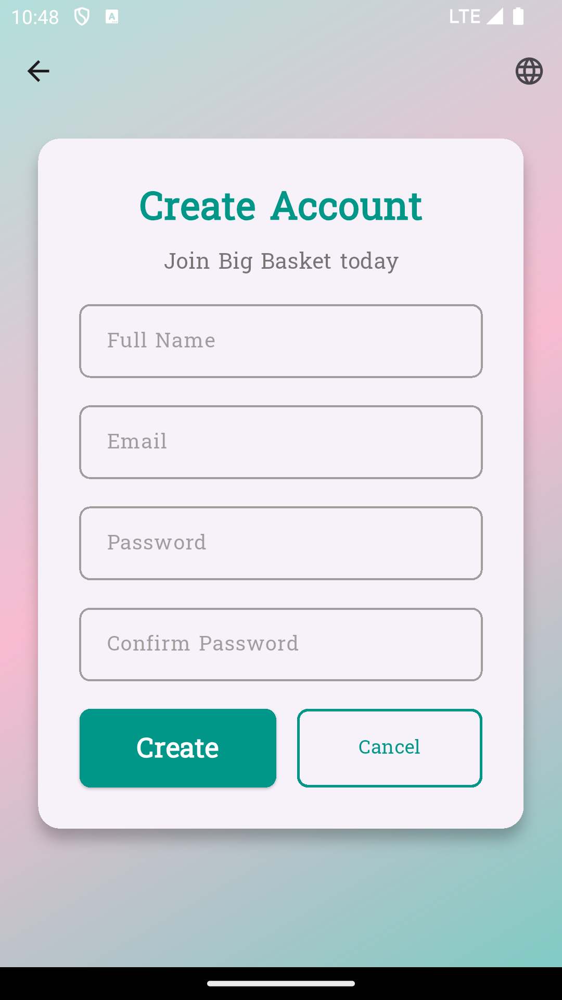

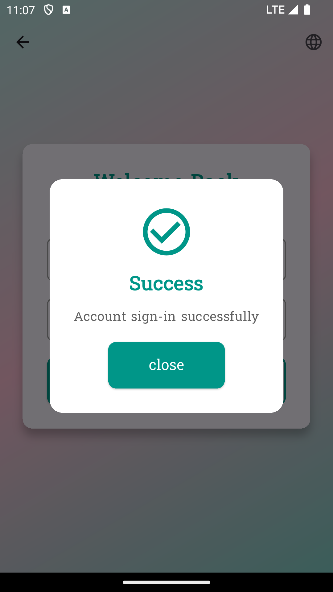

### Shopping Home Screen
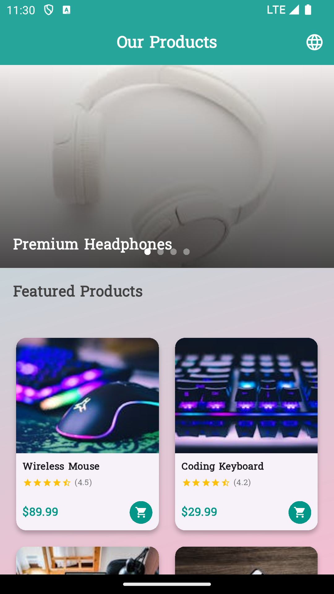
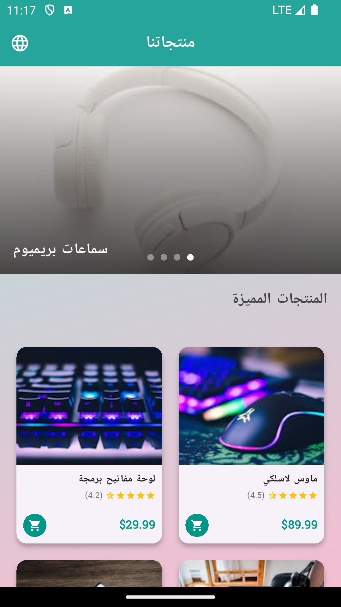
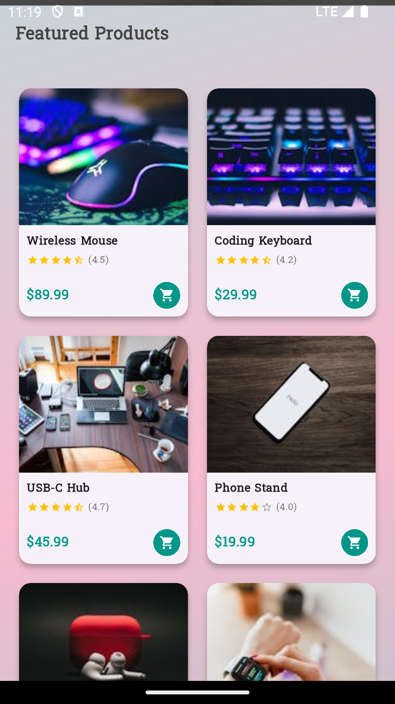
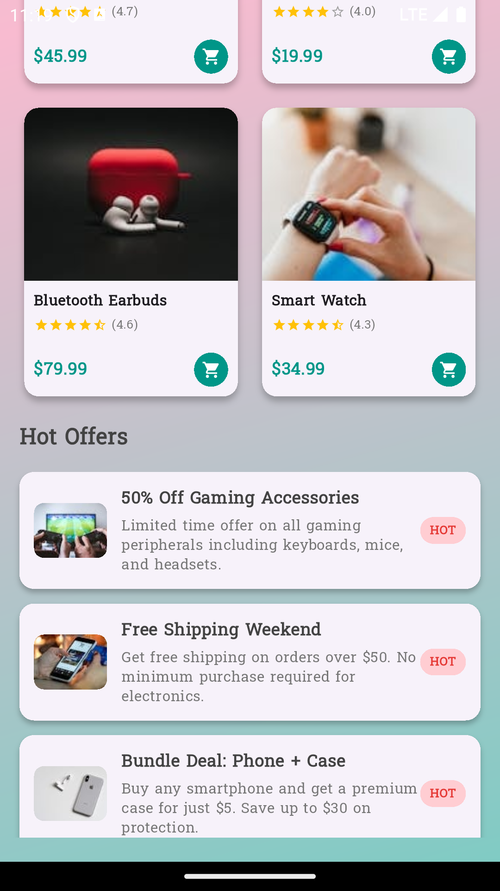
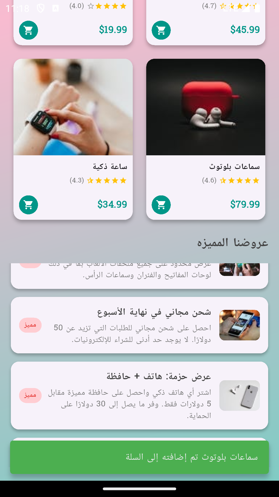

### Validation Examples
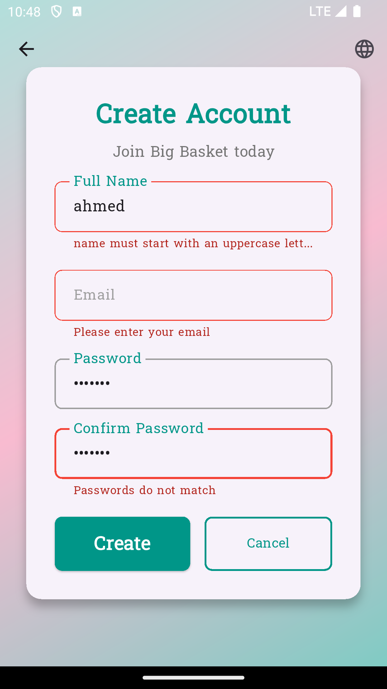


## 🚀 Future Enhancements

- [ ] Product detail screens
- [ ] Shopping cart functionality
- [ ] User profile management
- [ ] Payment integration
- [ ] Push notifications
- [ ] Offline data caching
- [ ] Advanced search and filtering

## 🤝 Contributing

1. Fork the repository
2. Create your feature branch (`git checkout -b feature/AmazingFeature`)
3. Commit your changes (`git commit -m 'Add some AmazingFeature'`)
4. Push to the branch (`git push origin feature/AmazingFeature`)
5. Open a Pull Request

## 📄 License

This project is licensed under the MIT License - see the [LICENSE](LICENSE) file for details.

## 👨‍💻 Author

**Your Name**
- GitHub: [@yourusername](https://github.com/yourusername)
- Email: your.email@example.com

---

## 📱 App Demo

The application demonstrates modern Flutter development practices with:
- Clean architecture principles
- Proper error handling
- Smooth animations
- Internationalization
- Responsive design
- User-friendly interface

Built with ❤️ using Flutter & Dart